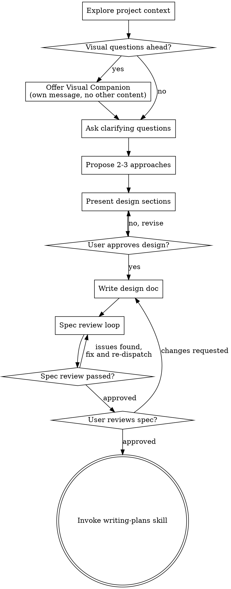

# Brainstorming Ideas Into Designs

Help turn ideas into fully formed designs and specs through natural collaborative dialogue.

Start by understanding the current project context, then ask questions one at a time to refine the idea. Once you understand what you're building, present the design and get user approval.

<HARD-GATE>
Do NOT invoke any implementation skill, write any code, scaffold any project, or take any implementation action until you have presented a design and the user has approved it. This applies to EVERY project regardless of perceived simplicity.
</HARD-GATE>

## Anti-Pattern: "This Is Too Simple To Need A Design"

Every project goes through this process. A todo list, a single-function utility, a config change — all of them. "Simple" projects are where unexamined assumptions cause the most wasted work. The design can be short (a few sentences for truly simple projects), but you MUST present it and get approval.

## Checklist

You MUST create a task for each of these items and complete them in order:

1. **Explore project context** — check files, docs, recent commits
2. **Offer visual companion** (if topic will involve visual questions) — this is its own message, not combined with a clarifying question. See the Visual Companion section below.
3. **Ask clarifying questions** — one at a time, understand purpose/constraints/success criteria
4. **Propose 2-3 approaches** — with trade-offs and your recommendation
5. **Present design** — in sections scaled to their complexity, get user approval after each section
6. **Write design doc** — save to `docs/superpowers/specs/YYYY-MM-DD-<topic>-design.md` and commit
7. **Spec review loop** — dispatch spec-document-reviewer subagent with precisely crafted review context (never your session history); fix issues and re-dispatch until approved (max 3 iterations, then surface to human)
8. **User reviews written spec** — ask user to review the spec file before proceeding
9. **Transition to implementation** — invoke writing-plans skill to create implementation plan

## Process Flow

**The terminal state is invoking writing-plans.** Do NOT invoke dapp-frontend, go-backend, smart-contract-security, or any other implementation skill. The ONLY skill you invoke after brainstorming is writing-plans.

## The Process

**Understanding the idea:**

- Check out the current project state first (files, docs, recent commits)
- Before asking detailed questions, assess scope: if the request describes multiple independent subsystems (e.g., "build a platform with chat, file storage, billing, and analytics"), flag this immediately. Don't spend questions refining details of a project that needs to be decomposed first.
- If the project is too large for a single spec, help the user decompose into sub-projects: what are the independent pieces, how do they relate, what order should they be built? Then brainstorm the first sub-project through the normal design flow. Each sub-project gets its own spec → plan → implementation cycle.
- For appropriately-scoped projects, ask questions one at a time to refine the idea
- Prefer multiple choice questions when possible, but open-ended is fine too
- Only one question per message - if a topic needs more exploration, break it into multiple questions
- Focus on understanding: purpose, constraints, success criteria

**Exploring approaches:**

- Propose 2-3 different approaches with trade-offs
- Present options conversationally with your recommendation and reasoning
- Lead with your recommended option and explain why

**Presenting the design:**

- Once you believe you understand what you're building, present the design
- Scale each section to its complexity: a few sentences if straightforward, up to 200-300 words if nuanced
- Ask after each section whether it looks right so far
- Cover: architecture, components, data flow, onchain/offchain split, access control model, upgrade strategy, security threat model, compliance requirements, event design for indexers, error handling, testing, frontend architecture, backend service design, ABI sync strategy, deployment topology
- Be ready to go back and clarify if something doesn't make sense

**Design for isolation and clarity:**

- Break the system into smaller units that each have one clear purpose, communicate through well-defined interfaces, and can be understood and tested independently
- For each unit, you should be able to answer: what does it do, how do you use it, and what does it depend on?
- Can someone understand what a unit does without reading its internals? Can you change the internals without breaking consumers? If not, the boundaries need work.
- Smaller, well-bounded units are also easier for you to work with - you reason better about code you can hold in context at once, and your edits are more reliable when files are focused. When a file grows large, that's often a signal that it's doing too much.

**Working in existing codebases:**

- Explore the current structure before proposing changes. Follow existing patterns.
- Where existing code has problems that affect the work (e.g., a file that's grown too large, unclear boundaries, tangled responsibilities), include targeted improvements as part of the design - the way a good developer improves code they're working in.
- Don't propose unrelated refactoring. Stay focused on what serves the current goal.

## After the Design

**Documentation:**

- Write the validated design (spec) to `docs/superpowers/specs/YYYY-MM-DD-<topic>-design.md`
  - (User preferences for spec location override this default)
- Use elements-of-style:writing-clearly-and-concisely skill if available
- Commit the design document to git

**Spec Review Loop:**
After writing the spec document:

1. Dispatch spec-document-reviewer subagent (see spec-document-reviewer-prompt.md)
2. If Issues Found: fix, re-dispatch, repeat until Approved
3. If loop exceeds 3 iterations, surface to human for guidance

**User Review Gate:**
After the spec review loop passes, ask the user to review the written spec before proceeding:

> "Spec written and committed to `<path>`. Please review it and let me know if you want to make any changes before we start writing out the implementation plan."

Wait for the user's response. If they request changes, make them and re-run the spec review loop. Only proceed once the user approves.

**Implementation:**

- Invoke the writing-plans skill to create a detailed implementation plan
- Do NOT invoke any other skill. writing-plans is the next step.

## Key Principles

- **One question at a time** - Don't overwhelm with multiple questions
- **Multiple choice preferred** - Easier to answer than open-ended when possible
- **YAGNI ruthlessly** - Remove unnecessary features from all designs
- **Explore alternatives** - Always propose 2-3 approaches before settling
- **Incremental validation** - Present design, get approval before moving on
- **Be flexible** - Go back and clarify when something doesn't make sense

## Blockchain & L2 Design Questions

When the project involves smart contracts, onchain logic, or blockchain interactions on HashKey Chain L2, you MUST explore these additional design dimensions during the clarifying questions phase:

**Onchain vs Offchain Split:**
- Which logic MUST be onchain? Which can be offchain? (Solidity is for ownership, transfers, and commitments. Not a database, not a backend.)
- How many contracts are needed? (MVP upper bound is 3 contracts. Each additional contract MUST be justified.)
- For every state transition: who calls it? Who pays Gas (HSK, not ETH)? What if nobody calls it?
- Remember: there are no timers, no cron jobs, no schedulers onchain. Design with incentives.

**Contract Architecture:**
- Does the contract need to be upgradeable? (Default: UUPS proxy. Justify if immutable.)
- What access control model? (Ownable for simple, AccessControl for RBAC, AccessManager for centralized management)
- What emergency mechanisms? (Pausable, circuit breaker, Guardian role, Timelock)
- What is the fund flow? Document every path money/tokens can take.

**Security Threat Model:**
- What oracle dependencies exist? (Chainlink, Uniswap TWAP, custom)
- Is there flash loan attack surface?
- Is there MEV/sandwich attack risk on user-facing swaps?
- What tokens will the contract interact with? (Verify decimals — USDC is 6, not 18)

**Compliance & Regulatory:**
- Does this feature involve KYC/AML requirements?
- Is ERC-3643 Security Token standard applicable?
- Does it need sanctions screening integration?
- What data privacy constraints apply? (No sensitive PII onchain)

**L2 & Cross-chain:**
- HashKey Chain uses HSK as Gas Token, not ETH — is this handled correctly?
- Are there cross-chain interactions via OP Standard Bridge?
- What happens if the L2 sequencer goes down? Is there a degradation path?

**Indexing & Monitoring:**
- What events need to be emitted for The Graph subgraph / custom indexer?
- What monitoring alerts are needed for this feature?

**NatSpec Documentation:**
- Every external/public function MUST have @dev, @param, @return NatSpec documentation (strict mode).

These questions should be woven naturally into the one-at-a-time clarifying question flow — not dumped all at once. Only ask questions relevant to the specific project.

## Frontend & Backend Architecture Questions

When the project involves a dApp frontend, Go backend, or data indexing, you MUST explore these design dimensions:

**Frontend Architecture:**
- What pages/routes does the dApp need? (Keep it minimal — most dApps need 3-5 pages)
- What wallet connection flow? (wagmi + viem is the default. Which connectors: injected, WalletConnect?)
- What transaction patterns exist? (Approve+Execute? Multi-step flows? Batch operations?)
- What data needs real-time updates? (WebSocket for prices/events vs polling for balances?)
- Which UI component library? (Default: shadcn/ui + Tailwind. Ant Design for complex forms/tables.)

**Backend Architecture (Go):**
- Does this project need a backend? (Pure frontend + contract is sufficient for many dApps.)
- What data does the backend serve that the frontend can't get from RPC/Subgraph?
- What events need to be indexed? (This drives the `hsk-superpowers:event-design` and `hsk-superpowers:data-indexing` skills.)
- Does the backend need to submit transactions? (If yes: key management, nonce management, gas estimation.)
- What external APIs does the backend integrate with? (Oracles, KYC providers, price feeds?)

**Data Flow Design:**
- Map the complete data flow: Contract events → Indexer → Backend API → Frontend display
- Which reads go through backend API vs direct RPC from frontend?
- What aggregations are needed that raw events can't provide?

**ABI Synchronization:**
- How many contracts does frontend/backend need to interact with?
- Establish ABI sync pipeline early: forge build → export → wagmi CLI / abigen (see `hsk-superpowers:abi-sync` skill)

**Deployment Architecture:**
- Frontend deployment target? (Docker + K8s is team default)
- Backend deployment target? (Docker + K8s is team default)
- Environment progression: localhost (anvil) → testnet (chain 133) → mainnet (chain 177)

These questions should be woven naturally into the clarifying question flow, same as blockchain questions. Only ask what's relevant.

## Visual Companion

A browser-based companion for showing mockups, diagrams, and visual options during brainstorming. Available as a tool — not a mode. Accepting the companion means it's available for questions that benefit from visual treatment; it does NOT mean every question goes through the browser.

**Offering the companion:** When you anticipate that upcoming questions will involve visual content (mockups, layouts, diagrams), offer it once for consent:
> "Some of what we're working on might be easier to explain if I can show it to you in a web browser. I can put together mockups, diagrams, comparisons, and other visuals as we go. This feature is still new and can be token-intensive. Want to try it? (Requires opening a local URL)"

**This offer MUST be its own message.** Do not combine it with clarifying questions, context summaries, or any other content. The message should contain ONLY the offer above and nothing else. Wait for the user's response before continuing. If they decline, proceed with text-only brainstorming.

**Per-question decision:** Even after the user accepts, decide FOR EACH QUESTION whether to use the browser or the terminal. The test: **would the user understand this better by seeing it than reading it?**

- **Use the browser** for content that IS visual — mockups, wireframes, layout comparisons, architecture diagrams, side-by-side visual designs
- **Use the terminal** for content that is text — requirements questions, conceptual choices, tradeoff lists, A/B/C/D text options, scope decisions

A question about a UI topic is not automatically a visual question. "What does personality mean in this context?" is a conceptual question — use the terminal. "Which wizard layout works better?" is a visual question — use the browser.

If they agree to the companion, read the detailed guide before proceeding:
`skills/brainstorming/visual-companion.md`
